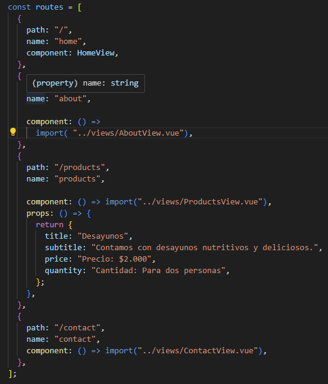
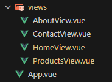
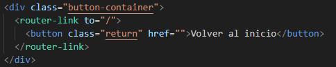
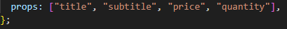
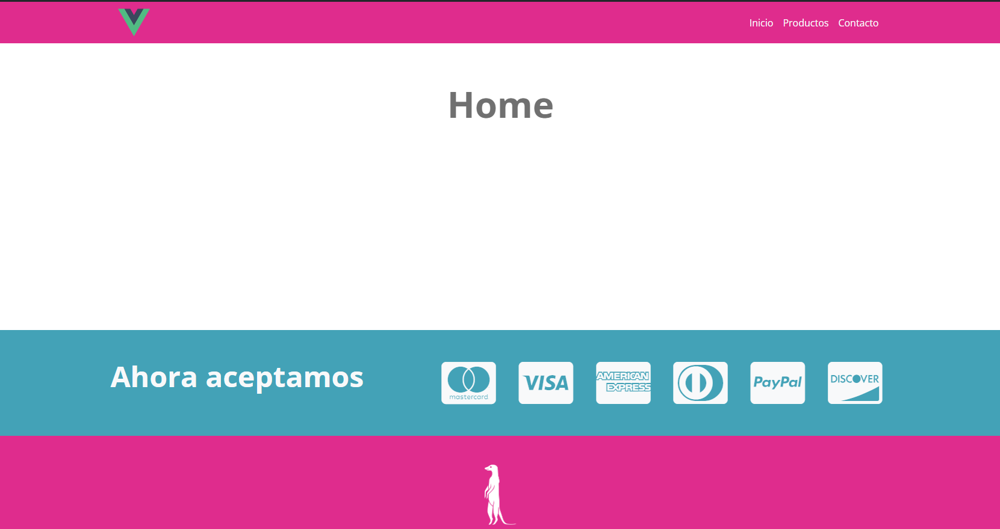

- [Desafío Vue Router (Suricata)](#desafío-vue-router-suricata)
  - [Requerimientos](#requerimientos)
  - [Pasos](#pasos)
  - [Resultado](#resultado)

# Desafío Vue Router (Suricata)

- Descripción

Aplicando los conocimientos adquiridos hasta el momento, el siguiente
desafío consiste en hacer funcionar un menú de navegación de una interfaz web
utilizando Vue Router para dar solución a una problemática.

  ---

## Requerimientos

1. Modificar el código del menú de navegación en sus ítems e integrar <router-link>.

2. Generar las rutas que se requieran según los ítems ya establecidos en el menú de
    navegación. Estas rutas van a cargar los componentes a través de carga controlada o
    lazy load.

3. Generar las vistas en su respectivo directorio para que las rutas definidas tengan
    funcionalidad y muestren información.
   
4. En la vista Productos y Contacto deberá haber un enlace de redirección al inicio del
    sitio.

5. En la vista de Productos.vue se recibirán props enviados desde la definición de la ruta
    logrando la siguiente visualización:  

   ---

## Pasos

1. Se crea una aplicación Vue en la consola A través del siguiente Comando "__*vue create --default mi-ejemplo*__"

2. Modificamos el código del menú de navegación e integramos router-link. 

3. Generamos las rutas que se requieran según los ítems:

4. Generamos las vistas en su respectivo directorio para que las rutas definidas:

5. En la vista de Productos y Contacto ponemos la redirección al inicio del
    sitio:

6. En la vista de Productos.vue se recibirán props enviados desde la definición de la ruta.

---

## Resultado

